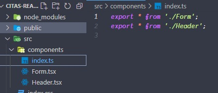

## Generador de rutas index
Cuando tienes un proyecto de tsx jsx ts js, hay un momento donde tienes muchos archivos y quieres simplificarlo en una ruta, como en el siguiente ejemplo, donde ya se me acumularon 2 componentes

Una manera podria ser digitar un index manualmente y actualizarlo cada vez que agregues un nuevo archivo o puedes hacer lo siguiente:

descargas el **`generate.js`**, lo colocas en la raiz de tu proyecto y luego lo ejecutas de la siguiente manera en consola **node generate src/components** y automaticamente generara el index.ts en tu proyecto, en caso no desees que sea index.**ts** y quieres que sea index.**js**, esto es facilemte modificable en **generate.js**

Cabe mencionar que al momento de ejecutar **node generate src/components**, la ruta de la carpeta donde quieras ejecutar el index es customizable, **node generate 'aca colocas la ruta de tu carpeta'***
